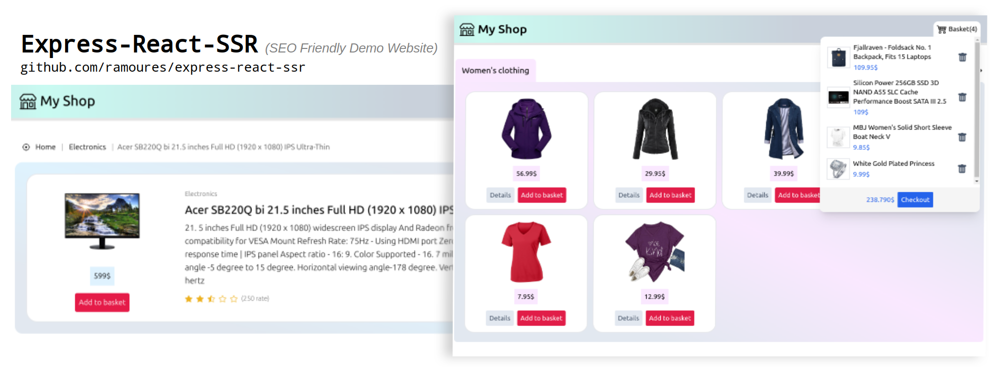
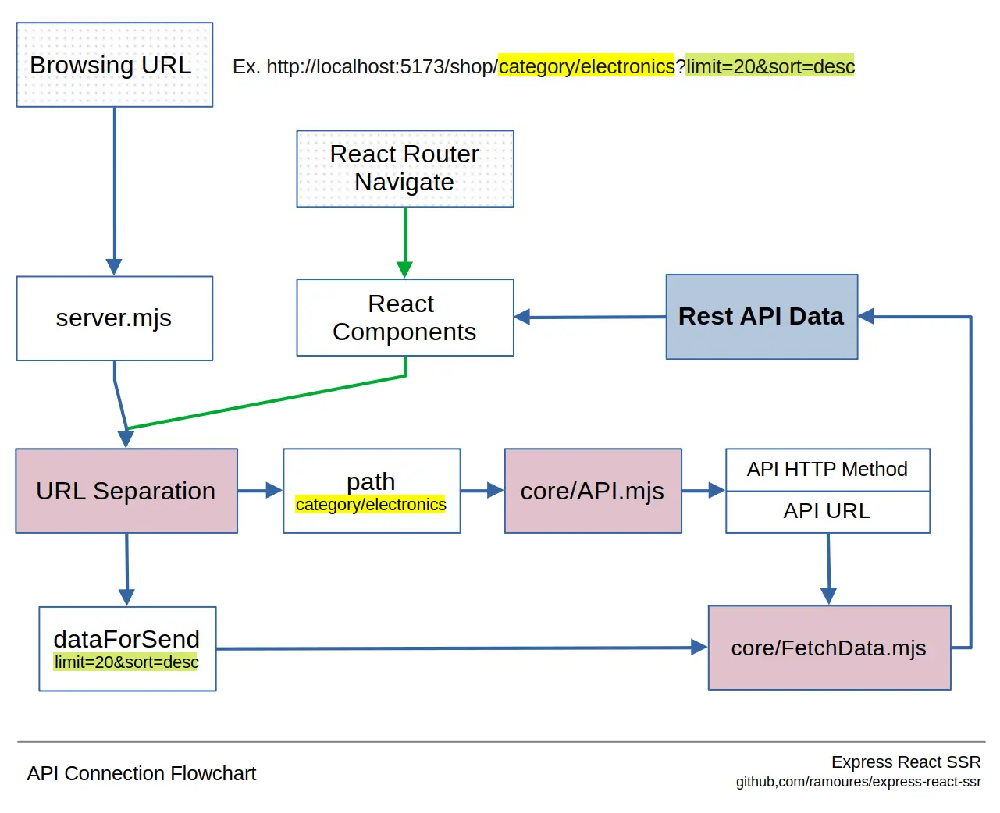

# Express React SSR

[فارسی](https://awaweb.ir/blog/posts/express-react-ssr) | English

ReactJS Server Side Rendering template (shopping website) by ExpressJS and Vite.

- Data fetching from Rest API
- Sitemap add-on
- SEO friendly

---

**[View Demo](https://awaweb.ir/projects/free/express-react-ssr)**

---

### Installation

1. `git clone git@github.com:ramoures/express-react-ssr.git`
2. `cd express-react-ssr`
3. `npm install`
4. `npm run build`
5. `npm start` or `node server.mjs`
6. Browse `http://localhost:5173/shop/`

> Update the `.env` file to edit/remove the _shop_ directory from the URL.

---

### Develop

- Tailwind CLI build and minify process: `npm run tw`
- `npm run dev`

  Browse `http://localhost:4173/shop/`

Always ready fresh template in development.

### Build

After development completion:

1. `npm run build` for build new _dist_ directory.
2. `npm start` or `node server.mjs`
3. Browse `http://localhost:5173/shop/`

---

### I Used

- Axios
- React Router Dom
- React Helmet
- Tailwind CSS framework
- **XML Sitemap**

> Data source: fakestoreapi.com

---

---

With the help of : [template-ssr-react-streaming](https://github.com/bluwy/create-vite-extra/tree/master/template-ssr-react-streaming)

License [Under The MIT License](./LICENSE)

Email: ramoures@gmail.com
